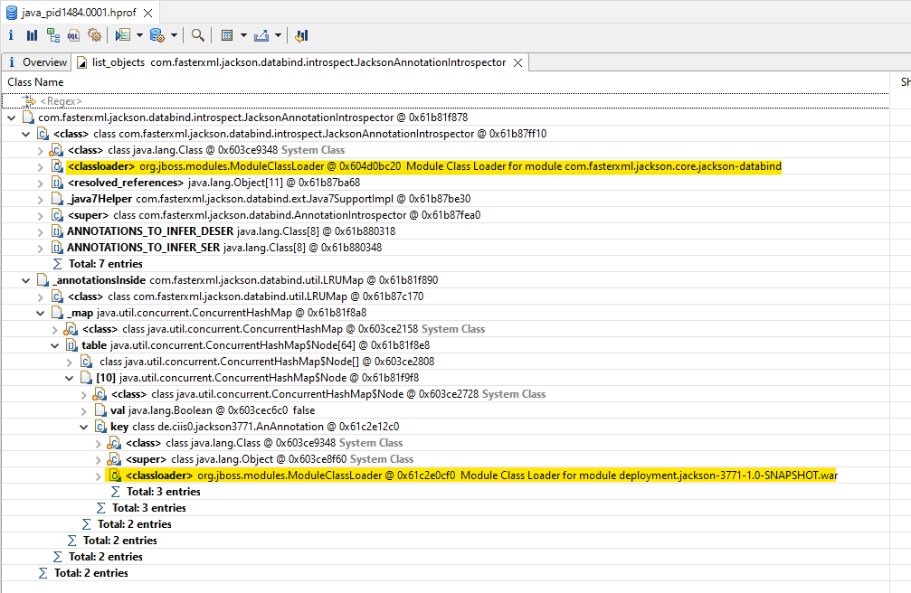
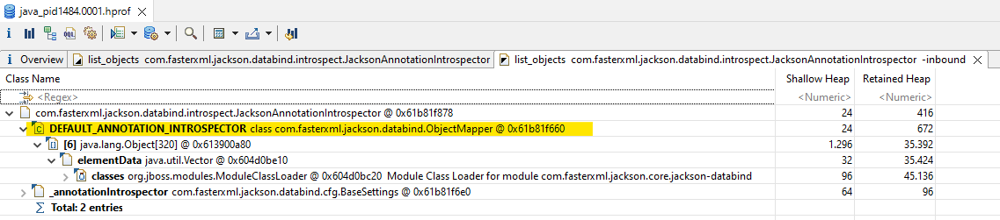

# Reproducer for jackson#3771

* install [Wildfly 27]
  * start via `bin/standalone.bat`/`.sh`
* install [Eclipse MAT]
* deploy the WAR of this repo
  * check releases if you don't want to build it yourself
  * simply dropping the WAR into `standalone/deployments` should be enough (picking it up takes up to 5 seconds on my machine)
* undeploy WAR
  * simply delete the WAR file again (and .deployed file if you want)
* acquire heap dump using MAT

## the leak

to find it in MAT:

1. *Open Query Browser* &rarr; *List objects* &rarr; *with outgoing references*
2. *Class:* `com.fasterxml.jackson.databind.introspect.JacksonAnnotationIntrospector`
3. Expand:
   1. `class`
   2. `_annotationsInside`
      1. `_map`
      2. `table`
      3. the single entry (`[10]`?)
      4. `key`

Reference to annotation class from deployment class-loader in annotation-introspector instance:

Static reference to annotation-introspector from `ObjectMapper`.

[Wildfly 27]: https://www.wildfly.org/downloads/
[Eclipse MAT]: https://www.eclipse.org/mat/downloads.php