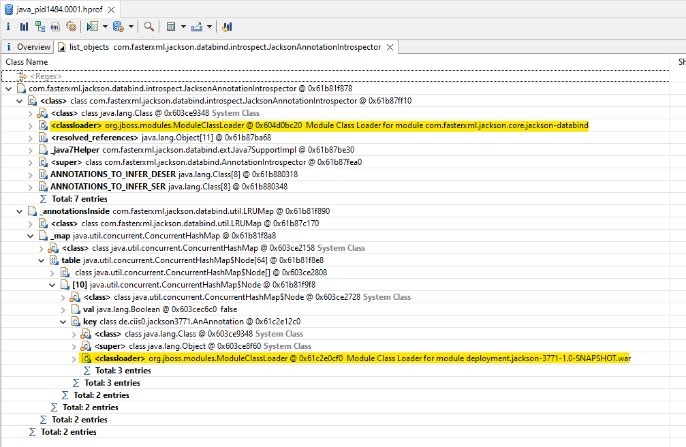

# Reproducer for jackson#3771

* install Wildfly 24
* install Eclipse MAT
* deploy this WAR
* undeploy WAR
* acquire heap dump using MAT

## the leak

to find it in MAT:

1. *Open Query Browser* &rarr; *List objects* &rarr; *with outgoing references*
2. *Class:* `com.fasterxml.jackson.databind.introspect.JacksonAnnotationIntrospector`
3. Expand:
   1. `class`
   2. `_annotationsInside`
      1. `_map`
      2. `table`
      3. the single entry (`[10]`?)
      4. `key`

